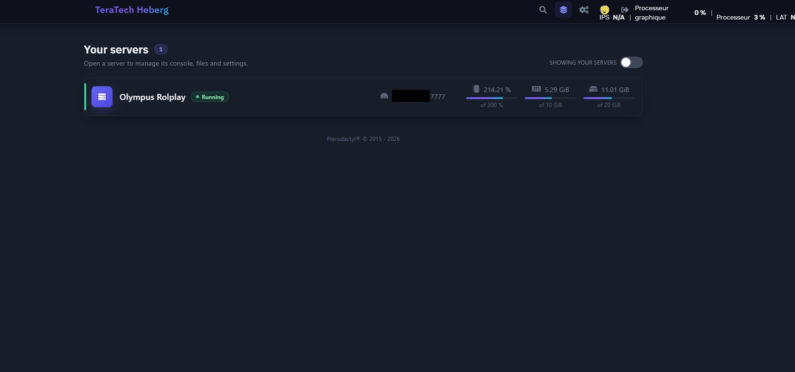
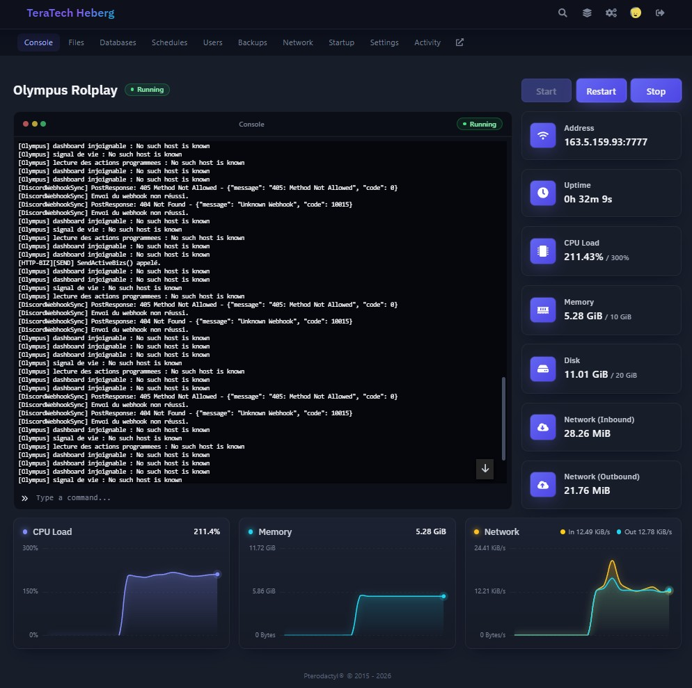
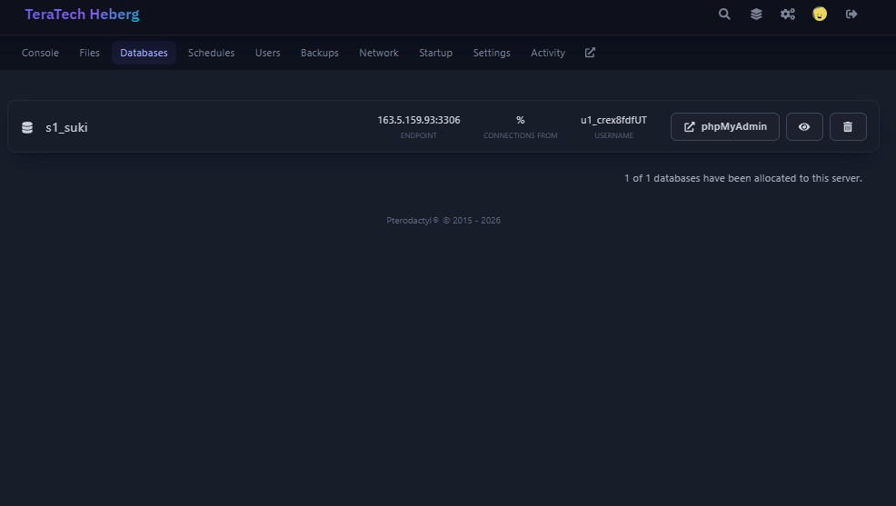
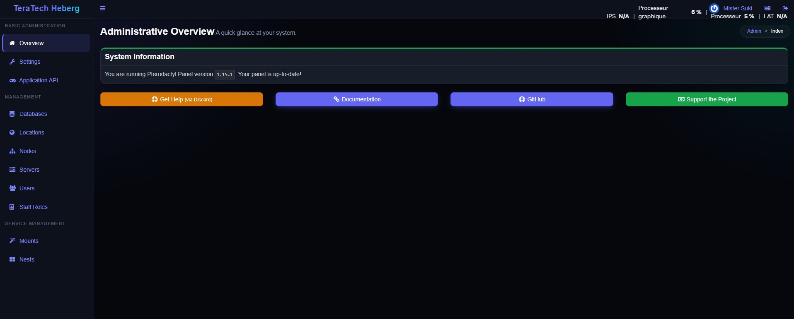
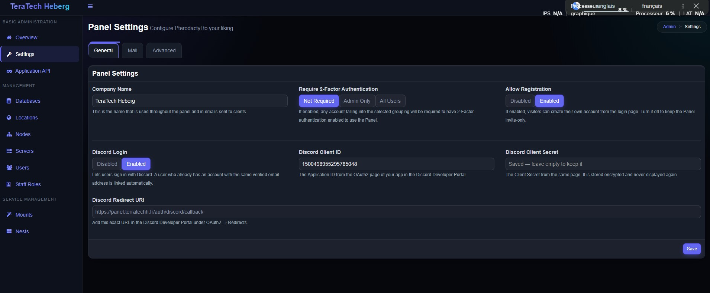
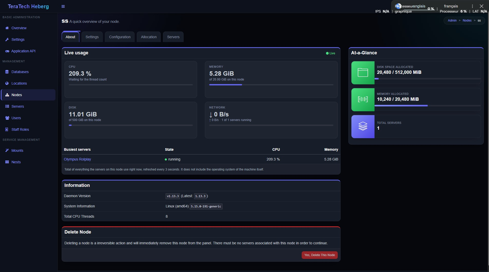
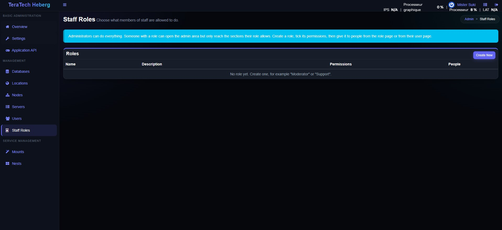
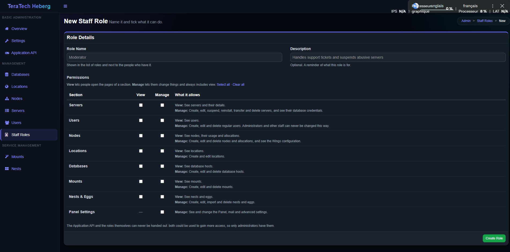

<div align="center">

<br>

# 🦖 Pterodactyl · Modern Indigo

### Le panel de jeu qui a enfin l'air d'un vrai hébergeur

Thème sombre bleu-nuit, accent indigo, cartes arrondies et animations douces pour le dashboard client **et** l'administration.<br>
Avec en plus : **inscription**, **connexion Discord**, **rôles de staff**, **eggs en un clic**, **phpMyAdmin intégré**, **stats en temps réel**<br>
et **un seul script** qui installe tout.

<br>


[](https://github.com/MisterSuki/panel-Pterodactyl-Modern-Indigo/stargazers)
[](https://github.com/MisterSuki/panel-Pterodactyl-Modern-Indigo/commits/main)
[](https://github.com/MisterSuki/panel-Pterodactyl-Modern-Indigo/issues)

<br>

[**🚀 Installer**](#-installation-en-une-commande) &nbsp;·&nbsp;
[**✨ Fonctionnalités**](#-fonctionnalités) &nbsp;·&nbsp;
[**📸 Aperçu**](#-aperçu) &nbsp;·&nbsp;
[**📚 Documentation**](#-documentation) &nbsp;·&nbsp;
[**❓ FAQ**](#-faq)

<br>

<a href="docs/images/panel1.jpg"></a>

</div>

<br>

---

## 🚀 Installation en une commande

Sur ton serveur, **en root** :

```bash
bash <(curl -s https://raw.githubusercontent.com/MisterSuki/panel-Pterodactyl-Modern-Indigo/main/install.sh)
```

Le script te propose un menu, ou tu lui donnes directement ce que tu veux :

| | Ce que tu veux faire | Option |
| :-: | --- | --- |
| **1** | 🆕 Installer le **panel** sur un serveur vierge (nginx, PHP, base de données, Redis, SSL, services) | `--panel` |
| **2** | 🖥️ Installer **Wings**, qui fait tourner les serveurs de jeu | `--wings` |
| **3** | 🔀 Installer les **deux** sur la même machine | `--panel --wings` |
| **4** | 🔄 **Mettre à jour** un panel déjà installé avec ce thème | `--update` |
| **5** | ⏪ **Restaurer** les fichiers d'avant une mise à jour | `--restore` |
| **6** | 🧹 **Désinstaller** le thème et retrouver le panel d'origine, sans rien perdre | `--uninstall` |
| **7** | 🗄️ Installer **phpMyAdmin** pour ouvrir les bases depuis le panel | `--phpmyadmin` |

> [!TIP]
> S'il détecte déjà un panel dans `/var/www/pterodactyl`, le script passe directement à la mise à jour.
> Ajoute `--dry-run` à n'importe quelle commande pour voir ce qui sera fait **sans rien changer**.

<br>

---

## ✨ Fonctionnalités

<table>
<tr>
<td width="33%" valign="top">

### 🎨 Design d'hébergeur

Sidebar et en-tête bleu-nuit, cartes arrondies, boutons et formulaires modernes, page de connexion en verre dépoli, statuts lumineux. Refait pour le dashboard **et** l'administration.

</td>
<td width="33%" valign="top">

### ⚡ Temps réel

Consommation de tes serveurs sur le dashboard, usage des nodes et joueurs FiveM : tout se met à jour **toutes les 3 secondes**, sans recharger la page.

</td>
<td width="33%" valign="top">

### 🔐 Inscription & Discord

Les visiteurs créent un compte ou se connectent avec **Discord**. Les comptes existants sont **liés automatiquement**. Invite aussi un sous-utilisateur avec son **ID Discord**.

</td>
</tr>
<tr>
<td width="33%" valign="top">

### 🛡️ Rôles de staff

Crée des rôles (modérateur, support…), coche leurs permissions **section par section** et donne-les à des personnes, sans en faire des administrateurs complets.

</td>
<td width="33%" valign="top">

### 🥚 Eggs en un clic

Tape le nom d'un egg (Valheim, Palworld, Node.js…), choisis le nest, et il est importé depuis **eggs.pterodactyl.io**. Plus de fichier à télécharger.

</td>
<td width="33%" valign="top">

### 🗄️ phpMyAdmin intégré

Un bouton sur la page *Databases* ouvre la base **déjà connecté**, sans mot de passe à copier. Lien à usage unique, valable une minute.

</td>
</tr>
<tr>
<td width="33%" valign="top">

### 🎮 Console & FiveM

Console avec **Pause** et **Clear**. Sur un serveur FiveM : **joueurs connectés** en direct et lien **txAdmin** à côté du nom.

</td>
<td width="33%" valign="top">

### 🧰 Installateur tout-en-un

Panel de A à Z, Wings, mise à jour avec **sauvegarde et retour en arrière**, désinstallation qui **garde tes données**. Un seul script, testé.

</td>
<td width="33%" valign="top">

### 🕶️ Discrétion & confort

**IP floutée** par défaut (un clic pour l'afficher), mémoire et disque saisis en **GB**, comptes Discord visibles dans la liste des utilisateurs.

</td>
</tr>
</table>

<br>

---

## 📸 Aperçu

<table>
  <tr>
    <td width="50%" valign="top">
      <a href="docs/images/panel2.jpg"></a><br>
      <sub><b>🎮 Console d'un serveur</b> — console, statistiques et graphiques en direct</sub>
    </td>
    <td width="50%" valign="top">
      <a href="docs/images/panel3.jpg"></a><br>
      <sub><b>🗄️ Bases de données</b> — le bouton phpMyAdmin ouvre la base déjà connecté</sub>
    </td>
  </tr>
  <tr>
    <td width="50%" valign="top">
      <a href="docs/images/panel4.jpg"></a><br>
      <sub><b>🧭 Administration</b> — vue d'ensemble</sub>
    </td>
    <td width="50%" valign="top">
      <a href="docs/images/panel5.jpg"></a><br>
      <sub><b>⚙️ Réglages du panel</b> — inscription et connexion Discord</sub>
    </td>
  </tr>
  <tr>
    <td width="50%" valign="top">
      <a href="docs/images/panel6.jpg"></a><br>
      <sub><b>📊 Node</b> — consommation en direct des serveurs du node</sub>
    </td>
    <td width="50%" valign="top">
      <a href="docs/images/panel7.jpg"></a><br>
      <sub><b>🛡️ Rôles de staff</b> — la liste des rôles</sub>
    </td>
  </tr>
  <tr>
    <td width="50%" valign="top">
      <a href="docs/images/panel8.jpg"></a><br>
      <sub><b>✅ Nouveau rôle</b> — permissions section par section</sub>
    </td>
    <td width="50%" valign="top" align="center">
      <br><br><br>
      <b>Et bien plus…</b><br>
      <sub>eggs de la communauté, FiveM, installateur,<br>sous-utilisateurs par ID Discord, GB…</sub>
    </td>
  </tr>
</table>

<br>

---

## 📚 Documentation

**Sommaire** &nbsp;
[Nouveau serveur](#-nouveau-serveur--le-panel-de-a-à-z) ·
[Wings](#-wings) ·
[Mise à jour](#-mettre-à-jour-un-panel-existant) ·
[Désinstaller](#-désinstaller-le-thème) ·
[Options](#-toutes-les-options) ·
[phpMyAdmin](#-phpmyadmin) ·
[Eggs](#-eggs-de-la-communauté) ·
[FiveM](#-serveurs-fivem) ·
[Console](#-console-et-petits-plus) ·
[Discord](#-inscription-et-connexion-discord) ·
[Rôles](#-rôles-de-staff)

### 🆕 Nouveau serveur : le panel, de A à Z

Sur un serveur **vierge** Ubuntu 22.04 / 24.04 ou Debian 11 / 12, avec un nom de domaine qui pointe déjà vers lui :

```bash
bash <(curl -s https://raw.githubusercontent.com/MisterSuki/panel-Pterodactyl-Modern-Indigo/main/install.sh) --panel
```

Il pose quelques questions (domaine, email, compte administrateur) puis fait tout, comme
[pterodactyl-installer](https://pterodactyl-installer.se) :

| Étape | Ce qui est fait |
| :-: | --- |
| 1 | installe **nginx, PHP 8.3, MariaDB et Redis** |
| 2 | crée la **base de données** avec un mot de passe aléatoire |
| 3 | installe le **panel** de ce dépôt (design, inscription, Discord, rôles) et ses dépendances |
| 4 | configure le panel, crée les tables et ton **compte administrateur** |
| 5 | compile le dashboard (avec un peu de swap temporaire si le serveur a peu de mémoire) |
| 6 | obtient un **certificat SSL** gratuit Let's Encrypt |
| 7 | installe la **file d'attente** (`pteroq`) et la **tâche planifiée** (cron) |
| 8 | installe **[phpMyAdmin](#-phpmyadmin)**, relié au panel (`--no-phpmyadmin` pour l'éviter) |
| 9 | ouvre les ports 80 et 443 si le pare-feu `ufw` est actif |

À la fin, il affiche l'adresse du panel et tes identifiants, et les enregistre dans
`/root/pterodactyl-credentials.txt` (lisible par root seulement, à supprimer ensuite).

<details>
<summary><b>Installer sans aucune question</b></summary>

<br>

```bash
bash <(curl -s https://raw.githubusercontent.com/MisterSuki/panel-Pterodactyl-Modern-Indigo/main/install.sh) \
  --panel --yes --fqdn=panel.example.com --email=toi@example.com --admin-user=toi
```

Sans mot de passe donné, il en génère un aléatoire. Sans domaine (adresse IP), il sert le panel en `http`, sans SSL.

</details>

> [!IMPORTANT]
> **Il ne touche jamais à l'existant** : il refuse de continuer si un panel est déjà installé, si le dossier n'est pas vide,
> ou si une base `panel` ou un utilisateur MySQL `pterodactyl` existent déjà. Si l'installation s'arrête en cours de route,
> relance la même commande : elle reprend proprement.

### 🖥️ Wings

Une fois le panel installé, crée une **Location** puis un **Node** dans *Admin*, puis sur la machine qui héberge les
serveurs de jeu :

```bash
bash <(curl -s https://raw.githubusercontent.com/MisterSuki/panel-Pterodactyl-Modern-Indigo/main/install.sh) --wings
```

Il installe Docker, télécharge Wings et crée le service `wings`. Il te reste à coller la configuration du node
(*Admin → Nodes → ton node → Configuration*) dans `/etc/pterodactyl/config.yml`, puis `systemctl enable --now wings`.

<details>
<summary><b>Tout faire d'un coup</b></summary>

<br>

Donne-lui l'adresse du panel, un jeton d'API et le numéro du node :

```bash
bash <(curl -s https://raw.githubusercontent.com/MisterSuki/panel-Pterodactyl-Modern-Indigo/main/install.sh) \
  --wings --panel-url=https://panel.example.com --wings-token=ptla_xxx --node-id=1
```

</details>

### 🔄 Mettre à jour un panel existant

```bash
bash <(curl -s https://raw.githubusercontent.com/MisterSuki/panel-Pterodactyl-Modern-Indigo/main/install.sh) --update
```

> [!IMPORTANT]
> **Le projet a changé de dépôt.** Il vit maintenant sur [`MisterSuki/panel-Pterodactyl-Modern-Indigo`](https://github.com/MisterSuki/panel-Pterodactyl-Modern-Indigo). L'ancienne adresse `MisterSuki/panel-ptero-terra` n'est plus mise à jour : si tu l'utilises encore, ton panel reste sur une ancienne version. Change l'adresse dans ta commande comme ci-dessus, une seule fois : le nouvel installateur pointe déjà sur le bon dépôt.

Il installe tout le contenu de ce dépôt sur ton panel **1.15.1** : le design, l'inscription, Discord, les rôles et
toutes les fonctionnalités ci-dessus. Il :

1. télécharge le dépôt et vérifie qu'il est complet, sans rien modifier tant que tout n'est pas en règle ;
2. **sauvegarde** chaque fichier qu'il va remplacer (dans `/var/backups/pterodactyl-theme/`) ;
3. met le panel en maintenance et copie les fichiers ;
4. lance les migrations de la base de données ;
5. installe les dépendances et compile le dashboard ;
6. vide les caches, redémarre la file d'attente et remet le panel en ligne.

Si la migration échoue, il remet les fichiers d'origine. Si la compilation échoue, il remet l'ancien dashboard
compilé pour que le panel continue de fonctionner, et t'indique quoi faire. Dans les deux cas, il te dit pourquoi.
Il refuse une version de panel différente de 1.15.1 (sauf avec `--force`).

> [!WARNING]
> Fais une **sauvegarde de ta base de données** avant : les migrations ajoutent des colonnes à la table `users` et une
> table `admin_roles`.

**Pour revenir en arrière :**

```bash
bash <(curl -s https://raw.githubusercontent.com/MisterSuki/panel-Pterodactyl-Modern-Indigo/main/install.sh) --restore
```

Les fichiers remplacés sont remis et ceux que la mise à jour a ajoutés sont supprimés. La base de données n'est pas
modifiée : les nouvelles tables et colonnes restent en place sans gêner. Si tu restaures le dashboard, recompile-le
ensuite avec `yarn build:production`.

> [!NOTE]
> **Le design n'apparaît pas ?** L'URL de la feuille de style de l'admin ne change jamais d'une version à l'autre,
> ton navigateur peut donc garder l'ancienne en cache. Fais un rechargement forcé (`Ctrl + Shift + R`)
> ou ouvre le panel dans une fenêtre de navigation privée.

### 🧹 Désinstaller le thème

```bash
bash <(curl -s https://raw.githubusercontent.com/MisterSuki/panel-Pterodactyl-Modern-Indigo/main/install.sh) --uninstall
```

Il remet le panel Pterodactyl officiel, avec son design et son dashboard d'origine. **Rien de ce que tu as créé n'est
perdu** : serveurs, utilisateurs, nodes, allocations, sauvegardes, bases de données, plannings, clés d'API et fichier
`.env` restent exactement comme ils sont. Il :

1. télécharge les fichiers officiels de **ta version** de Pterodactyl (dashboard déjà compilé compris) ;
2. **sauvegarde** les fichiers du thème dans `/var/backups/pterodactyl-theme/uninstall-…` ;
3. met le panel en maintenance, remet les fichiers d'origine et supprime ceux que seul le thème ajoutait ;
4. vide les caches, redémarre la file d'attente et remet le panel en ligne.

<details>
<summary><b>À savoir avant de désinstaller</b></summary>

<br>

- l'inscription, la connexion Discord et les rôles de staff ne fonctionnent plus ; les personnes qui n'avaient
  **qu'un rôle de staff** (et ne sont pas administrateurs) perdent leur accès à l'administration, mais leurs comptes
  et leurs serveurs ne bougent pas ;
- la base de données n'est pas modifiée : les colonnes Discord et la table `admin_roles` restent en place sans gêner
  le panel officiel ;
- le dossier `resources/scripts` est remplacé par celui d'origine (une sauvegarde est faite au cas où tu y aurais
  ajouté tes propres fichiers) ;
- phpMyAdmin reste installé mais le bouton disparaît, car le panel d'origine ne le connaît pas ;
- pour **remettre le thème** tel qu'il était : `bash <(curl -s https://raw.githubusercontent.com/MisterSuki/panel-Pterodactyl-Modern-Indigo/main/install.sh) --restore`.
  Pour installer la dernière version du thème : `--update`.

</details>

### ⚙️ Toutes les options

<details>
<summary><b>Voir la liste complète des options</b></summary>

<br>

| Option | Effet |
| --- | --- |
| `--panel`, `--wings`, `--update`, `--restore`, `--uninstall`, `--phpmyadmin` | Ce qu'il faut faire (sinon, menu) |
| `-y`, `--yes` | Ne pose aucune question |
| `--dry-run` | Vérifie tout et affiche le plan, sans rien changer |
| `--fqdn=`, `--email=` | Domaine (ou IP) et email, pour un nouveau panel |
| `--admin-user=`, `--admin-password=`, `--admin-first-name=`, `--admin-last-name=` | Compte administrateur créé à l'installation |
| `--timezone=` | Fuseau horaire du panel (celui du serveur par défaut) |
| `--ssl`, `--no-ssl` | Force ou désactive le certificat SSL |
| `--panel-url=`, `--wings-token=`, `--node-id=` | Configure Wings tout de suite |
| `--path=/chemin` | Dossier du panel, si ce n'est pas `/var/www/pterodactyl` |
| `--install-node` | Installe Node.js 22 et Yarn s'ils manquent (Debian/Ubuntu), pour une mise à jour |
| `--enable-settings-ui` | Passe `APP_ENVIRONMENT_ONLY` à `false` dans `.env` (mise à jour) |
| `--skip-build`, `--skip-migrate` | Ne compile pas le dashboard, ne lance pas les migrations |
| `--css-only` | Met à jour seulement le design de l'administration |
| `--force` | Met à jour même si la version du panel est différente (déconseillé) |
| `--no-phpmyadmin` | Avec `--panel` : n'installe pas phpMyAdmin |
| `--pma-source=` | Dossier ou archive `.tar.gz` de phpMyAdmin à utiliser au lieu de télécharger la dernière version |
| `--stock-version=`, `--stock-source=` | Avec `--uninstall` : version officielle à remettre (celle de ton panel par défaut), ou dossier / archive locale à la place du téléchargement |
| `--branch=`, `--repo=`, `--source=` | Installe depuis une autre branche, un autre dépôt (`MisterSuki/panel-Pterodactyl-Modern-Indigo` par défaut) ou un dossier local |

</details>

<br>

---

### 🗄️ phpMyAdmin

Il est installé avec le panel. Sur un panel **déjà installé avec ce thème** (mets-le d'abord à jour avec `--update` si
besoin) et qui tourne sous nginx :

```bash
bash <(curl -s https://raw.githubusercontent.com/MisterSuki/panel-Pterodactyl-Modern-Indigo/main/install.sh) --phpmyadmin
```

Il télécharge la dernière version de phpMyAdmin dans `/var/www/phpmyadmin`, la sert à l'adresse
`https://ton-panel/phpmyadmin/` (une ligne `include` est ajoutée au fichier nginx du panel, testée avec `nginx -t` et
annulée si nginx la refuse) et renseigne `PHPMYADMIN_URL` et `PHPMYADMIN_SECRET` dans le `.env` du panel. Tu peux le
relancer à tout moment : ça met phpMyAdmin à jour en gardant le même secret.

Ensuite, sur la page **Databases** d'un serveur, chaque base a un bouton **phpMyAdmin** : un clic ouvre la base dans un
nouvel onglet, **déjà connecté**, sans mot de passe à copier.

| 🔒 Comment c'est protégé | |
| --- | --- |
| **Lien à usage unique** | valable une minute. Il ne contient ni le mot de passe ni le nom d'utilisateur : le script de connexion de phpMyAdmin les demande au panel, avec un secret partagé qui reste sur le serveur |
| **Permission requise** | *View Password* du serveur (la même que pour voir le mot de passe de la base). L'ouverture est notée dans l'activité du serveur |
| **Pas de formulaire de connexion** | on ne peut entrer dans phpMyAdmin que par ce lien. Ouvrir `/phpmyadmin/` directement renvoie vers le panel |
| **Chacun sa base** | l'utilisateur de base est limité à sa propre base |

> [!NOTE]
> Le serveur qui héberge les bases (*Admin → Database Hosts*) doit accepter les connexions venant de la machine du
> panel : adresse de MariaDB/MySQL ouverte, et utilisateur de base autorisé depuis `%`, comme pour Pterodactyl.

### 🥚 Eggs de la communauté

Dans *Admin → Nests*, la boîte **« Add an egg from the community »** ajoute un egg sans télécharger ni envoyer de fichier :

1. **Tape le nom** de l'egg : la recherche se fait pendant que tu écris, sur les quelque 320 eggs publiés sur
   [eggs.pterodactyl.io](https://eggs.pterodactyl.io/) (jeux, applications et eggs génériques). Les majuscules, les
   espaces et les tirets ne comptent pas (`7days` trouve « 7 Days To Die »).
2. **Choisis le nest** dans « Put it in this nest ». Il propose déjà le bon quand le nom du jeu correspond à un nest
   (un egg Minecraft va vers le nest Minecraft), tu peux le changer.
3. Clique sur **Add** : l'egg est téléchargé et importé, avec ses variables, son script d'installation et ses images
   Docker, puis un bouton **Open** mène à sa page pour le modifier.

Si le nest a déjà un egg du même nom, le panel te le dit et te demande si tu veux l'ajouter quand même.

<details>
<summary><b>Sécurité et prérequis</b></summary>

<br>

C'est le même import que le bouton « Import Egg », donc rien de plus dangereux : le panel ne va chercher que les eggs de
la liste du site, et seulement leur fichier dans les dépôts officiels `pterodactyl/game-eggs`, `application-eggs` et
`generic-eggs`. Il faut la permission **Nests → Manage** (un administrateur ou un rôle de staff qui l'a). La liste est
gardée 6 heures pour aller vite ; le serveur du panel doit pouvoir joindre `eggs.pterodactyl.io` et
`raw.githubusercontent.com`.

</details>

### 🎫 Tickets de support

Un système de tickets intégré, avec **discussion en temps réel** et **transcription**.

- **Côté client** : un bouton *Support* dans la barre du haut (avec une pastille quand le staff a répondu). Chaque utilisateur ouvre un
  ticket (sujet, catégorie, priorité, serveur concerné), discute avec l'équipe dans une conversation qui se met à jour toute seule
  (toutes les 2 secondes tant que la page est ouverte), peut fermer et rouvrir son ticket. Cinq tickets ouverts au maximum par personne.
- **Côté administration** : le menu *Support → Tickets* (avec le nombre de tickets en attente). Liste filtrable (à traiter, en attente,
  répondu, fermé), recherche, « les miens » ; dans un ticket, la conversation en direct, les **notes internes** (invisibles pour
  l'utilisateur), la priorité, la prise en charge (« le prendre » ou un autre membre du staff) et la fermeture.
- **Transcription** : à tout moment, en **texte** ou en **page à imprimer** (à enregistrer en PDF depuis le navigateur), dans la langue
  de la personne. L'utilisateur reçoit ce qu'il a vu ; le staff peut avoir la version complète (notes internes et email) ou celle de
  l'utilisateur.
- **Rôles de staff** : une nouvelle section *Support Tickets* (voir / gérer) dans *Rôles de staff*. Un membre du staff qui peut seulement
  voir lit les tickets sans pouvoir répondre.

Les messages sont toujours affichés comme du texte : rien de ce qui est écrit ne peut s'exécuter dans la page.

### 🎮 Joueurs connectés des jeux Steam

Si le jeu ne répond pas à la requête Steam mais écrit le nombre de connexions dans sa console (par exemple
`Incoming connection: … - 3 connections.`), le panel le lit dans la console : le compteur est mis à jour tant que la page
Console est ouverte, et repart de zéro quand le serveur s'arrête ou démarre.

Pour un serveur créé à partir d'un egg **Steam** (image SteamCMD ou variable `SRCDS_APPID` : Source, Rust, ARK, Valheim, Nova-Life…), la
page Console affiche un bloc **Joueurs** (`6 / 25`), rafraîchi toutes les 3 secondes. Le panel interroge le jeu avec la **requête
Steam (A2S)**, en UDP, sur chacune des **allocations** du serveur (la première qui répond est mémorisée). Les bots ne sont pas comptés.

> [!NOTE]
> C'est le **jeu** qui décide de répondre. S'il ne répond pas, le bloc indique *Indisponible*. Dans ce cas, ajoute à ton serveur
> l'allocation du **port de requête** du jeu (souvent 27015 ou le port du jeu +1), le panel l'essaiera tout seul.

### 🎮 Serveurs FiveM

Sur la page *Console* d'un serveur FiveM (ou RedM), le panel ajoute :

- 👥 un bloc **Players** avec le nombre de joueurs connectés et la limite (`12 / 64`), qui passe au jaune puis au
  rouge quand le serveur se remplit. Il se met à jour toutes les 3 secondes environ, même pendant que le serveur démarre ;
- 🔗 un lien **txAdmin** à côté du nom du serveur, qui ouvre txAdmin (`http://adresse:port`) dans un nouvel onglet.
  Le port est celui de la variable `TXHOST_TXA_PORT` de l'egg (`TXADMIN_PORT` sur les anciens eggs, 40120 par défaut) ; le lien est caché si `TXADMIN_ENABLE`
  est à 0.

Le panel interroge lui-même le serveur (`/players.json` et `/info.json` sur son port de jeu), donc rien à installer ni à
configurer : il faut seulement que le port du serveur soit joignable depuis la machine du panel.

> [!NOTE]
> Le lien devient jaune avec un avertissement si le port de txAdmin n'est pas l'une des allocations du serveur
> (onglet *Network*) : il ne serait alors pas joignable de l'extérieur.

### 🌍 Langues

Le panel est disponible en **anglais** et en **français**.

- **Par défaut : l'anglais.** Dans *Admin → Settings → Language*, tu choisis la langue des **visiteurs** (pages de connexion) et des
  **nouveaux comptes**. Les comptes qui existent déjà gardent leur langue.
- **Chacun choisit la sienne** sur sa page *Account* (carte *Language*) : elle est enregistrée sur le compte et suivie sur tous les appareils.
  Sur les pages de connexion, de petits liens *English · Français* permettent de choisir sans compte.
- Un administrateur peut aussi changer la langue d'un utilisateur depuis sa page (*Admin → Users*).
- Le **dashboard** et les **pages de connexion** sont traduits, l'**administration** en grande partie (les textes techniques longs,
  comme les explications de la configuration Wings, peuvent rester en anglais), ainsi que le journal d'activité et les messages d'erreur
  et de validation. Les emails envoyés par le panel restent en anglais.

Comment c'est fait : les pages sont écrites en anglais, et un petit script (`public/js/translator.js`) remplace chaque texte par sa
traduction avec le dictionnaire `resources/lang/fr.json`. Il ne touche jamais à la console, à l'éditeur de fichiers, aux champs de
formulaire ni aux noms saisis par les utilisateurs (un serveur appelé « Console » reste « Console »). Un texte qui n'est pas dans le
dictionnaire reste en anglais : les phrases construites avec des nombres ou des noms, comme « 3 servers », ne sont pas toutes traduites.

Pour **ajouter une langue** : crée `resources/lang/<code>/` (copie le dossier `en`) et `resources/lang/<code>.json` (copie `fr.json` et
traduis les valeurs). Elle apparaît toute seule dans les listes de langues. Pour **corriger une traduction**, modifie le fichier `.json`
ou `.php` correspondant, puis recharge la page.

### ⏳ Suspension des serveurs

Dans *Admin → Servers → ton serveur → Manage*, la suspension a maintenant :

- une **raison**, écrite par toi et **montrée au client** (« paiement en retard », « signalement d'abus »…) ;
- une **durée** : jusqu'à ce que tu la lèves, ou 1 h, 6 h, 24 h, 3 j, 7 j, 30 j, ou une date précise. À l'échéance, le serveur retrouve son
  accès **tout seul** (vérifié chaque minute par la tâche planifiée du panel) ;
- un bouton **Save changes** pour changer la raison ou la durée d'une suspension en cours, sans toucher au serveur ;
- le détail de qui l'a suspendu, depuis quand et jusqu'à quand.

Ce que voit le client : sur son **dashboard**, la raison sous le nom du serveur et « Access back in 3 hours » ; sur la
**page du serveur**, un écran « Server Suspended » avec la raison, la date de suspension et celle du retour de l'accès.
Dans la liste des serveurs de l'administration, le badge *Suspended* affiche la raison et la date de fin au survol.

L'API Application accepte aussi `reason` et `until` sur `POST /api/application/servers/{id}/suspend`. Une suspension sans
raison ni durée fonctionne comme avant. Les détails sont dans la table `server_suspensions` (créée par la mise à jour) ;
elle ne change rien à la façon dont Pterodactyl gère l'état suspendu.

### ©️ Copyright personnalisé

Dans *Admin → Settings*, les champs **Copyright** et **Copyright Link** remplacent la ligne « Pterodactyl® © 2015 - 2026 » en bas de
toutes les pages : dashboard, connexion et administration. `{year}` est remplacé par l'année en cours (ex. `© {year} TeraTech Heberg`).
Le lien est facultatif (seules les adresses `http://` et `https://` sont acceptées). Vide, c'est la ligne d'origine qui s'affiche.

### 💾 Sauvegardes automatiques

Sur la page *Backups* d'un serveur, une carte **Sauvegardes automatiques** (bouton *Configure*) permet de choisir :

- la **fréquence** : toutes les 6 h, 12 h, tous les jours ou toutes les semaines (à l'**heure** de ton choix pour le jour et la semaine) ;
- le **nombre à conserver** : au-delà, les plus anciennes sauvegardes automatiques sont supprimées ;
- les **fichiers à ignorer**, un chemin par ligne (sinon, le fichier `.pteroignore` du serveur s'applique).

La page affiche aussi une **barre d'usage** (sauvegardes stockées sur la limite du serveur), la **prochaine sauvegarde**, et le dernier
problème s'il y en a eu un. Les sauvegardes automatiques portent une pastille **Auto**, les verrouillées une pastille **Locked**.

> [!IMPORTANT]
> Le panel ne supprime **jamais** une sauvegarde faite à la main ni une sauvegarde **verrouillée**. Si la limite du serveur est atteinte,
> il supprime la plus ancienne sauvegarde *automatique* pour faire de la place ; s'il n'y en a pas, il n'en crée pas et te le dit.

Tout repose sur la tâche planifiée du panel (le `cron` de `schedule:run`, déjà installé), qui vérifie chaque minute. Un serveur
injoignable ou occupé est réessayé 15 minutes plus tard sans gêner les autres. Les réglages sont dans la table
`server_backup_plans`, créée par la mise à jour.

### 🧩 Console et petits plus

| | Ce que ça fait |
| --- | --- |
| 🔠 **Titre en 3D** | Le nom du panel (*Admin → Settings → Company Name*) s'affiche en relief dans la barre du haut et en grand sur les pages de connexion et d'inscription |
| 🎛️ **Administration relookée** | Menu latéral avec icônes en tuiles, compteurs (serveurs, utilisateurs, nodes), carte du compte connecté et retour au dashboard ; menu réduit propre ; listes déroulantes, fenêtres de confirmation, infobulles, encadrés et pagination aux couleurs du thème ; barres de défilement fines |
| 🎫 **Tickets de support** | Conversation en temps réel entre l'utilisateur et le staff, notes internes, priorités, prise en charge, transcription en texte ou à imprimer (voir [Tickets de support](#-tickets-de-support)) |
| 🟢 **Actifs en temps réel** | Sur l'accueil de l'administration, la carte *Actifs en ce moment* liste les personnes qui utilisent le panel, avec **la page où elles sont** (Console, Fichiers, Sauvegardes, Compte, Support…) et le **serveur** concerné, et disparaissent dès qu'elles se déconnectent. Mise à jour toutes les 5 secondes. Actif = une action dans les 2 dernières minutes (le dashboard signale sa page toutes les 30 secondes tant qu'il est à l'écran). Seul le *type* de page est gardé, jamais l'adresse complète ; la liste est réservée à ceux qui peuvent voir les utilisateurs |
| 🧭 **Accueil de l'administration** | Un vrai tableau de bord : nombre de serveurs, utilisateurs, nodes et emplacements, **capacité de chaque node** (mémoire et disque promis aux serveurs, en vert, jaune puis rouge), derniers serveurs et derniers utilisateurs, actions rapides. Un membre du staff ne voit que les sections qui lui sont ouvertes |
| 🗂️ **Dashboard repensé** | Résumé en haut (serveurs, en ligne, CPU et mémoire cumulés), cartes éclairées selon l'état du serveur, **jauges circulaires** CPU / mémoire / disque qui passent au jaune puis au rouge, adresse floutée dans une pastille, et recherche + filtre En ligne / Hors ligne dès 4 serveurs |
| 🖥️ **Console améliorée** | Console dans un cadre arrondi, barre d'outils **Rechercher / Copier / Pause / Clear**, `[étiquettes]` en bleu, heures en gris, erreurs en rouge, avertissements en jaune, succès en vert et traces d'exception en gris, ligne de commande avec bouton d'envoi, bouton « retour en bas » rond |
| 🔘 **Boutons d'alimentation** | *Start / Restart / Stop* avec icônes, couleurs, état d'attente pendant que le serveur répond, et *Kill* quand l'arrêt traîne |
| 📈 **Graphiques fluides** | Les courbes CPU, mémoire et réseau glissent en continu (60 images/s) au lieu de sauter une fois par seconde |
| ⏸️ **Pause / Clear** | Dans la console, **Pause** gèle l'écran pour lire ou copier (les nouvelles lignes attendent, jusqu'à 5000, et s'affichent au **Resume**). **Clear** vide la console |
| 🕶️ **IP floutée** | L'adresse d'un serveur est floutée sur le dashboard et la console ; un clic sur l'œil l'affiche. Copier l'adresse copie toujours la vraie |
| ⚡ **Dashboard en direct** | CPU, mémoire et disque de tous tes serveurs, rafraîchis toutes les 3 secondes avec **une seule requête** pour toute la page |
| 📊 **Usage des nodes** | Sur la page d'un node : consommation en direct de ses serveurs (CPU, mémoire, disque, réseau) et des serveurs qui consomment le plus |
| 📏 **Mémoire et disque en GB** | À la création d'un serveur et dans sa configuration, on saisit des **GB** ; le panel garde des MiB en interne |
| 💬 **Discord dans les listes** | Le compte Discord lié apparaît dans la liste des utilisateurs et sur la page de chaque utilisateur |
| 🌍 **Anglais et français** | Le panel existe en **anglais** (par défaut) et en **français** : dashboard, pages de connexion et administration. Chacun choisit sa langue sur sa page *Account*, l'administrateur fixe celle des visiteurs et des nouveaux comptes dans *Admin → Settings* (voir [Langues](#-langues)) |
| ⏳ **Suspension améliorée** | Une raison visible par le client, une durée avec **levée automatique**, et le détail affiché sur le dashboard et la page du serveur (voir [Suspension](#-suspension-des-serveurs)) |
| ©️ **Copyright modifiable** | La ligne du bas de page se change dans *Admin → Settings* (voir [Copyright personnalisé](#️-copyright-personnalisé)) |
| 💾 **Sauvegardes automatiques** | Fréquence, nombre à conserver et fichiers ignorés par serveur, avec suppression des plus anciennes (voir [Sauvegardes automatiques](#-sauvegardes-automatiques)) |
| 👥 **Sous-utilisateur par ID Discord** | Dans l'onglet *Users* d'un serveur, invite quelqu'un avec son email **ou son ID Discord** (il doit déjà avoir un compte avec Discord lié) |

> [!NOTE]
> L'usage d'un node est la **somme de ce que consomment ses serveurs** : Wings ne donne pas l'usage du système lui-même.

<br>

---

### 🔐 Inscription et connexion Discord

<details open>
<summary><b>Ce que ça fait</b></summary>

<br>

- **Inscription** : une case *Allow Registration* dans *Admin → Settings*. Activée, la page de connexion affiche
  « Create one » et les visiteurs peuvent créer un compte (prénom, nom, pseudo, email, mot de passe). Désactivée,
  le panel reste sur invitation. reCAPTCHA protège l'inscription comme la connexion.
- **Connexion Discord** : un bouton « Continue with Discord » sur les pages de connexion et d'inscription.
- **Synchronisation avec un compte existant** : si l'adresse email **vérifiée** du compte Discord correspond à un
  compte du panel, les deux sont liés automatiquement. Un utilisateur peut aussi lier ou délier Discord depuis la
  page *Account*.
- **Nouveaux comptes** : si l'inscription est ouverte, un utilisateur Discord inconnu obtient un compte créé à partir
  de son profil Discord.

</details>

<details>
<summary><b>Garde-fous</b></summary>

<br>

- Un email **non vérifié** côté Discord ne lie jamais un compte et ne permet pas d'en créer un.
- Les **administrateurs et le staff** ne sont pas liés automatiquement par email : ils lient Discord depuis leur
  page *Account* une fois connectés avec leur mot de passe.
- La **double authentification** n'est pas contournée : un compte protégé passe toujours par la page de code 2FA.
- Le *Client Secret* est enregistré chiffré et n'est jamais réaffiché.

</details>

<details>
<summary><b>Mise en place</b></summary>

<br>

1. Sur le [Discord Developer Portal](https://discord.com/developers/applications), crée une application puis, dans
   *OAuth2*, copie le **Client ID** et le **Client Secret**.
2. Dans le panel : *Admin → Settings*, active **Discord Login**, colle le Client ID et le Client Secret, puis copie
   l'URL affichée dans **Discord Redirect URI** vers *OAuth2 → Redirects* sur le portail Discord (l'URL doit être
   identique, y compris `https://`).
3. Dans le fichier `.env`, `APP_ENVIRONMENT_ONLY` doit valoir `false` (une nouvelle installation le fait toute seule,
   la mise à jour avec `--enable-settings-ui`). Avec `true`, le panel ignore les réglages enregistrés depuis
   l'interface : un bandeau rouge le rappelle sur la page Settings.

Les réglages peuvent aussi être fournis par `.env` : `APP_REGISTRATION`, `DISCORD_ENABLED`, `DISCORD_CLIENT_ID`,
`DISCORD_CLIENT_SECRET`.

</details>

### 🛡️ Rôles de staff

Jusqu'ici, on était administrateur (accès à tout) ou simple utilisateur. Les rôles ajoutent un niveau intermédiaire.

1. *Admin → Staff Roles → Create New* : donne un nom (par exemple « Modérateur ») et coche les permissions.
2. Donne le rôle à des personnes : depuis la page du rôle (champ *Add someone*, par pseudo ou email) ou depuis la page
   d'un utilisateur (liste *Staff Role*).
3. Ces personnes voient alors, dans l'administration, uniquement les sections autorisées. Un lien **Admin** apparaît
   aussi dans la barre de navigation du dashboard.

Modifier un rôle s'applique tout de suite à toutes les personnes qui l'ont. Supprimer un rôle les remet simples
utilisateurs, sans rien supprimer d'autre.

**Permissions** : chaque section propose **View** (ouvrir les pages) et **Manage** (modifier). *Manage* inclut toujours *View*.

| Section | View | Manage |
| --- | --- | --- |
| **Servers** | Voir les serveurs | Créer, modifier, suspendre, réinstaller, transférer, supprimer, voir les accès aux bases |
| **Users** | Voir les utilisateurs | Créer, modifier, supprimer des utilisateurs simples |
| **Nodes** | Voir les nodes et allocations | Créer, modifier, supprimer, voir la configuration Wings |
| **Locations, Databases, Mounts, Nests & Eggs** | Voir | Créer, modifier et supprimer ce que la section permet |
| **Panel Settings** | — | Voir et modifier les réglages du panel |

<details>
<summary><b>🔒 Ce qu'un rôle ne peut jamais donner</b></summary>

<br>

- La **clé d'API Application** et la **gestion des rôles** restent réservées aux administrateurs : les deux permettent
  de s'accorder plus de droits.
- Le staff ne peut **pas modifier ni supprimer un administrateur ou un autre membre du staff**, ni donner le statut
  d'administrateur ou un rôle. Sinon, changer l'email ou le mot de passe de quelqu'un reviendrait à prendre son accès.
- Les pages qui affichent des secrets (configuration Wings d'un node, accès aux bases d'un serveur) demandent
  *Manage*, même pour les consulter.
- Si l'authentification à deux facteurs est exigée pour les administrateurs, elle l'est aussi pour le staff.

</details>

<br>

---

## ❓ FAQ

<details>
<summary><b>Je ne vois pas le nouveau design après une mise à jour</b></summary>

<br>

Fais un rechargement forcé avec `Ctrl + Shift + R`, ou ouvre le panel dans une fenêtre de navigation privée : la
feuille de style de l'administration garde la même adresse d'une version à l'autre et peut rester en cache.

</details>

<details>
<summary><b>Est-ce que je perds mes serveurs si je désinstalle le thème ?</b></summary>

<br>

Non. `--uninstall` ne touche pas à la base de données : serveurs, utilisateurs, nodes, sauvegardes, clés d'API et
`.env` restent tels quels. Les fichiers du thème sont sauvegardés, et `--restore` les remet.

</details>

<details>
<summary><b>Le bouton phpMyAdmin n'apparaît pas</b></summary>

<br>

Il faut que phpMyAdmin soit installé (`--phpmyadmin`), que le panel soit à jour (`--update`) et que tu aies la permission
**View Password** sur le serveur. Sans `PHPMYADMIN_URL` et `PHPMYADMIN_SECRET` dans le `.env`, le bouton reste caché.

</details>

<details>
<summary><b>Le nombre de joueurs FiveM reste sur « Waiting… »</b></summary>

<br>

Le panel interroge le port de jeu du serveur : il doit être joignable depuis la machine du panel, et le serveur doit avoir
fini de démarrer. Le compteur se met à jour tout seul dès que FiveM répond.

</details>

<details>
<summary><b>L'installation s'est arrêtée en route</b></summary>

<br>

Relance la même commande : l'installateur est fait pour être répété et reprend là où il s'est arrêté. Le message d'erreur
indique la ligne et la cause.

</details>

<br>

---

## 🧩 Compatibilité

- Conçu et testé sur **Pterodactyl Panel 1.15.1**. La mise à jour refuse une autre version : elle remplace des fichiers
  du cœur (routes, modèle utilisateur, middlewares).
- Nouvelle installation : **Ubuntu 22.04 / 24.04** et **Debian 11 / 12**. Utilise `bash <(curl ...)` et non
  `curl ... | bash`, sinon le script ne peut pas te poser ses questions.
- Si tu as déjà personnalisé ton panel, compare d'abord les fichiers listés dans
  [`install-manifest.txt`](install-manifest.txt) avec les tiens : ce sont ceux que l'installation remplace.

## 🛠️ Développement

Pour travailler sur le thème en local (Node.js 22+ et Yarn) :

```bash
git clone https://github.com/MisterSuki/panel-Pterodactyl-Modern-Indigo.git
cd panel-Pterodactyl-Modern-Indigo
yarn install
yarn watch   # recompile à chaque modification
```

Les couleurs et les ombres sont définies dans [`tailwind.config.js`](tailwind.config.js) (dashboard client) et
dans les variables CSS `--pd-*` de [`public/themes/pterodactyl/css/pterodactyl.css`](public/themes/pterodactyl/css/pterodactyl.css)
(administration).

> [!IMPORTANT]
> Quand tu ajoutes ou modifies un fichier, ajoute-le à [`install-manifest.txt`](install-manifest.txt) : l'installateur
> ne copie que ce qui est listé.

## 📄 Crédits et licence

Ce projet est un thème construit sur [Pterodactyl Panel](https://github.com/pterodactyl/panel), publié sous
[licence MIT](LICENSE.md). Il n'est ni affilié ni approuvé par le projet Pterodactyl.
Pterodactyl® est une marque de ses propriétaires.

Un problème, une idée ? Ouvre une [issue](https://github.com/MisterSuki/panel-Pterodactyl-Modern-Indigo/issues) sur le dépôt.

<br>

<div align="center">

**Fait avec 💜 pour les hébergeurs de jeux**

<sub>Si ce thème te plaît, une ⭐ sur le dépôt fait toujours plaisir.</sub>

</div>
